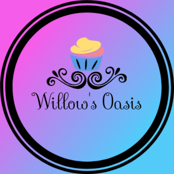

<p align="center">
  
</p>

# Willow's Oasis

## Overview

This project is a React application built using TypeScript and Vite. It features a bakery catalog where users can browse, search for cakes, and manage a shopping cart. The project integrates an external API to fetch product data dynamically.

## Technologies Used

- **React** (with TypeScript) - for building the user interface
- **Vite** - for fast development and build optimization
- **CSS** - for styling components
- **AJAX (fetch API)** - for retrieving external data
- **RapidAPI (the-birthday-cake-db API)** - used to fetch product information
- **Git & GitHub** - for version control

## Approach Taken

The project follows a component-based architecture with reusable UI components such as `ProductCard`, `Cart`, `NavBar`, etc.

State management is handled using React's `useState` and `useContext` hooks. Data fetching occurs inside the `useAppState.tsx` file, where an API call retrieves product details, which are then mapped and displayed in the UI.

## Usage Instructions

1. Clone the repository:
   ```sh
   git clone https://github.com/yourusername/your-repository.git
   ```
2. Navigate to the project directory:
   ```sh
   cd your-repository
   ```
3. Install dependencies:
   ```sh
   npm install
   ```
4. Run the development server:
   ```sh
   npm run dev
   ```
5. Open the application in your browser at `http://localhost:5173/`

## External API Usage

The project fetches product data from:
   ```js
   fetch("https://the-birthday-cake-db.p.rapidapi.com", {
     method: "GET",
     headers: {
       "X-RapidAPI-Key": "YOUR_API_KEY",
       "X-RapidAPI-Host": "the-birthday-cake-db.p.rapidapi.com",
     },
   })
   ```

## Unsolved Problems

- No user authentication is implemented yet.
- Error handling can be improved to gracefully handle API failures.

## Future Enhancements

- Add page routing
- Filter product search
- Add user authentication
- Improve the UI with animations and better styling